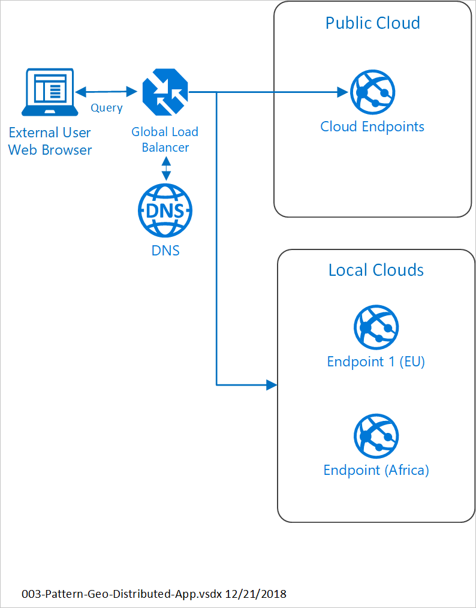

# Geo-distributed pattern

Provide app endpoints across multiple regions. Route user traffic based on location and compliance needs.

## Context and problem

Organizations with wide-reaching geographies strive to securely and accurately distribute and enable access to data while ensuring required levels of security, compliance and performance per user, location, and device across borders.

## Solution

The Azure Stack geographic traffic routing pattern, or Geo-Distributed Apps, allows traffic to be directed to specific endpoints based on various metrics. Creating a Traffic Manager with geographic-based routing and endpoint configuration routes traffic to endpoints based on regional requirements, corporate and international regulation, and data needs.

**Traffic Manager**  
In the diagram this is located outside of the public cloud, but it would need to able to coordinate traffic in both the local data center and the public cloud. The balancer routes traffic to geographical locations.

**Domain Name System (DNS)**  
The Domain Name System, or DNS, is responsible for translating (or resolving) a website or service name to its IP address.

### Public cloud

**Cloud Endpoint**  
Public IP addresses are used to route the incoming traffic through traffic manager to the public cloud application resources endpoint.  

### Local clouds

**Local endpoint**  
Public IP addresses are used to route the incoming traffic through traffic manager to the public cloud application resources endpoint.

## Issues and considerations

You should consider the following points when deciding how to implement this pattern:

### Scalability considerations

The pattern handles geographical traffic routing rather than scaling to meet increases in traffic. However, you can combine this pattern with other Azure and on-premises solutions. For example, this pattern can be used with the Cross-cloud Scaling Pattern.

### Availability considerations

Ensure locally deployed apps are configured for high-availability through on-premises hardware configuration and software deployment.

### Manageability considerations

The pattern ensures seamless management and familiar interface between environments.

## When to use this pattern

-   My organization has international branches requiring custom regional security and distribution policies.

-   Each of my organization’s offices pulls employee, business, and facility data, requiring reporting activity per local regulations and time zone.

-   High scale requirements can be met by horizontally scaling out apps, with multiple app deployments being made within a single region, as well as across regions, to handle extreme load requirements.

-   The applications must be highly available and responsive to client requests even in case of a single region outage.

## Example

Learn how to direct traffic to specific endpoints based on various metrics using the geo-distributed apps pattern. Creating a Traffic Manager profile with geographic-based routing and endpoint configuration ensures information is routed to endpoints based on regional requirements, corporate and international regulation, and your data needs.

[Create a geo-distributed app solution with Azure and Azure Stack](https://docs.microsoft.com/azure/azure-stack/user/azure-stack-solution-geo-distributed)

## Next steps

Learn about [Hybrid cloud design patterns for Azure Stack](azure-stack-edge-pattern-overview.md)
