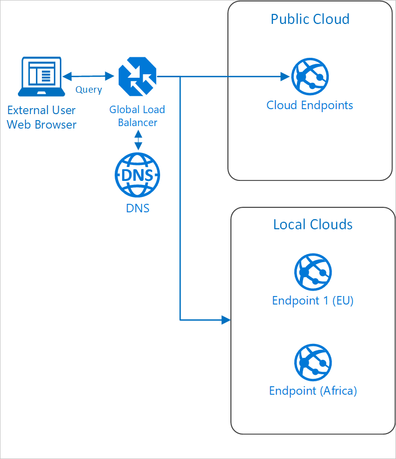

# Geo-distributed pattern

Learn how to provide app endpoints across multiple regions, and route user traffic based on location and compliance needs.

## Context and problem

Organizations with wide-reaching geographies strive to securely and accurately distribute and enable access to data while ensuring required levels of security, compliance and performance per user, location, and device across borders.

## Solution

The Azure Stack Hub geographic traffic routing pattern, or geo-distributed apps, allows traffic to be directed to specific endpoints based on various metrics. Creating a Traffic Manager with geographic-based routing and endpoint configuration routes traffic to endpoints based on regional requirements, corporate and international regulation, and data needs.

## Components

**Traffic Manager**  
In the diagram, Traffic Manager is located outside of the public cloud, but it would need to able to coordinate traffic in both the local data center and the public cloud. The balancer routes traffic to geographical locations.

**Domain Name System (DNS)**  
The Domain Name System, or DNS, is responsible for translating (or resolving) a website or service name to its IP address.

### Public cloud

**Cloud Endpoint**  
Public IP addresses are used to route the incoming traffic through traffic manager to the public cloud application resources endpoint.  

### Local clouds

**Local endpoint**  
Public IP addresses are used to route the incoming traffic through traffic manager to the public cloud application resources endpoint.

## Issues and considerations

Consider the following points when deciding how to implement this pattern:

### Scalability

The pattern handles geographical traffic routing rather than scaling to meet increases in traffic. However, you can combine this pattern with other Azure and on-premises solutions. For example, this pattern can be used with the Cross-cloud Scaling Pattern.

### Availability

Ensure locally deployed apps are configured for high-availability through on-premises hardware configuration and software deployment.

### Manageability

The pattern ensures seamless management and familiar interface between environments.

## When to use this pattern

- My organization has international branches requiring custom regional security and distribution policies.
- Each of my organization’s offices pulls employee, business, and facility data, requiring reporting activity per local regulations and time zone.
- High scale requirements can be met by horizontally scaling out apps, with multiple app deployments being made within a single region, as well as across regions, to handle extreme load requirements.
- The applications must be highly available and responsive to client requests even in the case of a single region outage.

## Next steps

To learn more about topics introduced in this article:
- See the [Azure Traffic Manager overview](/azure/traffic-manager/traffic-manager-overview) to learn more about how this DNS-based traffic load balancer works.
- See [Hybrid application design considerations](overview-app-design-considerations.md) to learn more about best practices, and answer additional questions.
- See the [Azure Stack family of products and solutions](/azure-stack), to learn more about the entire portfolio of products and solutions.

When you're ready to test the solution example, continue with the [Geo-distributed app solution deployment guide](solution-deployment-guide-geo-distributed.md). The deployment guide provides step-by-step instructions for deploying and testing its components. You learn how to direct traffic to specific endpoints, based on various metrics using the geo-distributed apps pattern. Creating a Traffic Manager profile with geographic-based routing and endpoint configuration ensures information is routed to endpoints based on regional requirements, corporate and international regulation, and your data needs.