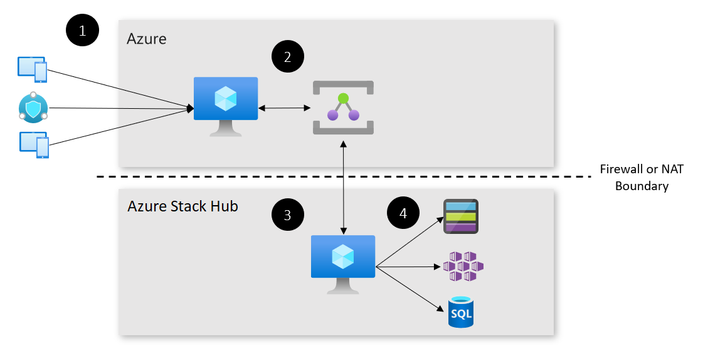

# Hybrid relay pattern

Learn how to connect to edge resources or devices protected by firewalls using the hybrid relay pattern and Azure Service Bus Relays.

## Context and problem

Edge devices are often behind a corporate firewall or NAT device. Although they're secure, they may be unable to communicate with the public cloud or edge devices on other corporate networks. It may be necessary to expose certain ports and functionality to users in the public cloud in a secure manner.

## Solution

The hybrid relay pattern uses Azure Service Bus Relays to establish a WebSockets tunnel between two endpoints that can't directly communicate. Devices that aren't on-premises but need to connect to an on-premises endpoint will connect to an endpoint in the public cloud. This endpoint will redirect the traffic on predefined routes over a secure channel. An endpoint inside the on-premises environment receives the traffic and routes it to the correct destination.

Here's how the hybrid relay pattern works:

1. A device connects to the virtual machine (VM) in Azure, on a predefined port.
2. Traffic is forwarded to the Service Bus relay in Azure.
3. The VM on Azure Stack Hub, which has already established a long-lived connection to the Service Bus Relay, receives the traffic and forwards it on to the destination.
4. The on-premises service or endpoint processes the request.

## Components

This solution uses the following components:

| Layer | Component | Description |
|----------|-----------|-------------|
| Azure | Azure VM | An Azure VM provides a publicly accessible endpoint for the on-premises resource. |
| | Azure Service Bus Relay | An [Azure Service Bus Relay](/azure/service-bus-relay/) provides the infrastructure for maintaining the tunnel and connection between the Azure VM and Azure Stack Hub VM.|
| Azure Stack Hub | Compute | An Azure Stack Hub VM provides the server-side of the Hybrid Relay tunnel. |
| | Storage | The AKS engine cluster deployed into Azure Stack Hub provides a scalable, resilient engine to run the Face API container.|

## Issues and considerations

Consider the following points when deciding how to implement this solution:

### Scalability

This pattern only allows for 1:1 port mappings on the client and server. For example, if port 80 is tunneled for one service on the Azure endpoint, it can't be used for another service. Port mappings should be planned accordingly. The Service Bus relay and VMs should be appropriately scaled to handle traffic.

### Availability

These tunnels and connections aren't redundant. To ensure high-availability, you may want to implement error checking code. Another option is to have a pool of Service Bus relay-connected VMs behind a load balancer.

### Manageability

This solution can span many devices and locations, which could get unwieldy. Azure's IoT services can automatically bring new locations and devices online and keep them up to date.

### Security

This pattern as shown allows for unfettered access to a port on an internal device from the edge. Consider adding an authentication mechanism to the service on the internal device, or in front of the hybrid relay endpoint.

## Next steps

To learn more about topics introduced in this article:

- This pattern uses Azure Service Bus Relays. For more information, see the [Azure Service Bus Relay documentation](/azure/service-bus-relay/).
- See [Hybrid application design considerations](overview-app-design-considerations.md) to learn more about best practices and get answers to any additional questions.
- See the [Azure Stack family of products and solutions](/azure-stack) to learn more about the entire portfolio of products and solutions.

When you're ready to test the solution example, continue with the [Hybrid relay solution deployment guide](https://aka.ms/hybridrelaydeployment). The deployment guide provides step-by-step instructions for deploying and testing its components.