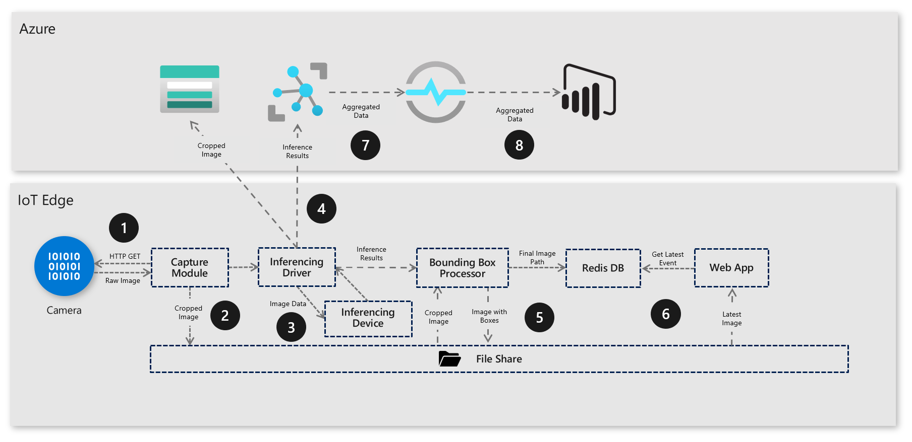

# Out of stock detection at the edge pattern

This pattern illustrates how to determine if shelves have out of stock items using an Azure Stack Edge or Azure IoT Edge device and network cameras.

## Context and problem

Physical retail stores lose sales because when customers look for an item, it's not present on the shelf. However, the item could have been in the back of the store and not been restocked. Stores would like to use their staff more efficiently and get automatically notified when items need restocking.

## Solution

The solution example uses an edge device, like an Azure Stack Edge in each store, which efficiently processes data from cameras in the store. This optimized design lets stores send only relevant events and images to the cloud. The design saves bandwidth, storage space, and ensures customer privacy. As frames are read from each camera, an ML model processes the image and returns any out of stock areas. The image and out of stock areas are displayed on a local web app. This data can be sent to a Time Series Insight environment to show insights in Power BI.

Here's how the solution works:

1. Images are captured from a network camera over HTTP or RTSP.
2. The image is resized and sent to the inference driver, which communicates with the ML model to determine if there are any out of stock images.
3. The ML model returns any out of stock areas.
4. The inferencing driver uploads the raw image to a blob (if specified), and sends the results from the model to Azure IoT Hub and a bounding box processor on the device.
5. The bounding box processor adds bounding boxes to the image and caches the image path in an in-memory database.
6. The web app queries for images and shows them in the order received.
7. Messages from IoT Hub are aggregated in Time Series Insights.
8. Power BI displays an interactive report of out of stock items over time with the data from Time Series Insights.

## Components

This solution uses the following components:

| Layer | Component | Description |
|----------|-----------|-------------|
| On-premises hardware | Network camera | A network camera is required, with either an HTTP or RTSP feed to provide the images for inference. |
| Azure | Azure IoT Hub | [Azure IoT Hub](/azure/iot-hub/) handles device provisioning and messaging for the edge devices. |
|  | Azure Time Series Insights | [Azure Time Series Insights](/azure/time-series-insights/) stores the messages from IoT Hub for visualization. |
|  | Power BI | [Microsoft Power BI](https://powerbi.microsoft.com/) provides business-focused reports of out of stock events. Power BI provides an easy-to-use dashboard interface for viewing the output from Azure Stream Analytics. |
| Azure Stack Edge or Azure IoT Edge device | Azure IoT Edge | [Azure IoT Edge](/azure/iot-edge/) orchestrates the runtime for the on-premises containers and handles device management and updates.|
| | Azure project brainwave | On an Azure Stack Edge device, [Project Brainwave](https://blogs.microsoft.com/ai/build-2018-project-brainwave/) uses Field-Programmable Gate Arrays (FPGAs) to accelerate ML inferencing.|

## Issues and considerations

Consider the following points when deciding how to implement this solution:

### Scalability

Most machine learning models can only run at a certain number of frames per second, depending on the provided hardware. Determine the optimal sample rate from your camera(s) to ensure that the ML pipeline doesn't back up. Different types of hardware will handle different numbers of cameras and frame rates.

### Availability

It's important to consider what might happen if the edge device loses connectivity. Consider what data might be lost from the Time Series Insights and Power BI dashboard. The example solution as provided isn't designed to be highly available.

### Manageability

This solution can span many devices and locations, which could get unwieldy. Azure's IoT services can automatically bring new locations and devices online and keep them up to date. Proper data governance procedures must be followed as well.

### Security

This pattern handles potentially sensitive data. Make sure keys are regularly rotated and the permissions on the Azure Storage Account and local shares are correctly set.

## Next steps

To learn more about topics introduced in this article:
- Multiple IoT related services are used in this pattern, including [Azure IoT Edge](/azure/iot-edge/), [Azure IoT Hub](/azure/iot-hub/), and [Azure Time Series Insights](/azure/time-series-insights/).
- To learn more about Microsoft Project Brainwave, see [the blog announcement](https://blogs.microsoft.com/ai/build-2018-project-brainwave/) and checkout out the [Azure Accelerated Machine Learning with Project Brainwave video](https://www.youtube.com/watch?v=DJfMobMjCX0).
- See [Hybrid app design considerations](overview-app-design-considerations.md) to learn more about best practices and to get answers to any additional questions.
- See the [Azure Stack family of products and solutions](/azure-stack) to learn more about the entire portfolio of products and solutions.

When you're ready to test the solution example, continue with the [Tiered data for analytics solution deployment guide](https://aka.ms/edgeinferencingdeploy). The deployment guide provides step-by-step instructions for deploying and testing its components.
